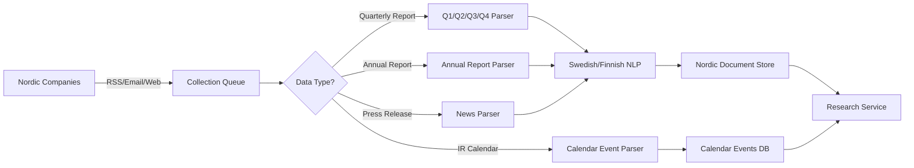

# YodaBuffett - Nordic Financial Data Ingestion

## Overview
Comprehensive data ingestion service for Nordic financial information. This is ONE of several ingestion services in the YodaBuffett ecosystem:

**This Service Handles:**
- **Financial Reports**: Quarterly (Q1, Q2, Q3) and annual reports
- **Company News**: Press releases and material announcements  
- **Financial Calendars**: Upcoming report dates and investor events
- **Coverage**: Sweden, Norway, Denmark, Finland

**Other Services** (future): US market data, earnings calls, global sector analysis, etc.

## Service Architecture

### 1. Nordic Ingestion Module (`backend/nordic_ingestion/`)

**Architecture**: Modular monolith - Nordic ingestion as a module within the main backend service.

```
backend/
├── main.py                        # Single FastAPI app serving all services
├── shared/                        # Shared utilities across services
├── research/                      # MVP1 research service module
└── nordic_ingestion/             # Nordic data ingestion module
    ├── api/
    │   ├── router.py              # All Nordic API endpoints
    │   └── schemas.py             # Pydantic request/response models
    ├── models/
    │   ├── companies.py           # NordicCompany, NordicDataSource
    │   ├── documents.py           # NordicDocument, NordicIngestionLog
    │   ├── calendar.py            # NordicCalendarEvent
    │   └── manual_tasks.py        # ManualCollectionTask
    ├── collectors/
    │   ├── rss/
    │   │   └── swedish_rss_collector.py     # Swedish RSS feeds
    │   ├── calendar/
    │   │   └── swedish_calendar_collector.py # Swedish IR calendars
    │   ├── email/                 # (Future) IR email parsing
    │   └── web/                   # (Future) Web scraping
    └── companies/                 # Company-specific configurations
        └── sweden/                # Swedish company configs
```

### 2. Nordic Financial Data Pipeline



## Database Schema

### PostgreSQL - Core Data

```sql
-- Nordic company registry
CREATE TABLE nordic_companies (
    id UUID PRIMARY KEY,
    name VARCHAR(255) NOT NULL,
    ticker VARCHAR(50),
    exchange VARCHAR(50), -- 'OMXS30', 'Oslo Bors', 'OMXH', 'OMXC'
    country VARCHAR(2) CHECK (country IN ('SE', 'NO', 'DK', 'FI')),
    market_cap_category VARCHAR(50), -- 'Large', 'Mid', 'Small'
    sector VARCHAR(100),
    ir_email VARCHAR(255),
    ir_website TEXT,
    reporting_language VARCHAR(10) DEFAULT 'sv',
    metadata JSONB
);

-- Nordic company data sources
CREATE TABLE nordic_data_sources (
    id UUID PRIMARY KEY,
    company_id UUID REFERENCES nordic_companies(id),
    source_type VARCHAR(50), -- 'rss_feed', 'ir_email', 'web_scraping'
    priority INTEGER,
    config JSONB, -- RSS URL, email patterns, scraping selectors
    status VARCHAR(50), -- 'working', 'broken', 'rate_limited'
    last_success TIMESTAMP,
    failure_count INTEGER DEFAULT 0,
    notes TEXT
);

-- Nordic financial reports and news
CREATE TABLE nordic_documents (
    id UUID PRIMARY KEY,
    company_id UUID REFERENCES nordic_companies(id),
    document_type VARCHAR(50) CHECK (document_type IN ('Q1', 'Q2', 'Q3', 'annual', 'press_release', 'other')),
    report_period VARCHAR(50), -- 'Q1_2024', 'FY_2024', '2024-01-15' for news
    title TEXT,
    source_url TEXT,
    storage_path TEXT, -- S3 path
    file_hash VARCHAR(64), -- SHA256 for deduplication
    language VARCHAR(10), -- 'sv', 'no', 'da', 'fi', 'en'
    ingestion_date TIMESTAMP,
    processing_status VARCHAR(50), -- 'pending', 'extracted', 'indexed', 'failed'
    page_count INTEGER,
    file_size_mb DECIMAL,
    metadata JSONB -- extraction results, key metrics, etc.
);

-- Nordic ingestion logs  
CREATE TABLE nordic_ingestion_logs (
    id UUID PRIMARY KEY,
    source_id UUID REFERENCES nordic_data_sources(id),
    timestamp TIMESTAMP,
    collection_type VARCHAR(50), -- 'scheduled', 'manual', 'retry'
    status VARCHAR(50), -- 'success', 'partial', 'failed'
    error_message TEXT,
    reports_found INTEGER,
    reports_downloaded INTEGER,
    news_items_found INTEGER,
    processing_time_seconds INTEGER
);

-- Nordic financial calendar events
CREATE TABLE nordic_calendar_events (
    id UUID PRIMARY KEY,
    company_id UUID REFERENCES nordic_companies(id),
    event_type VARCHAR(50) CHECK (event_type IN ('Q1_report', 'Q2_report', 'Q3_report', 'annual_report', 'agm', 'earnings_call', 'other')),
    event_date DATE NOT NULL,
    event_time TIME, -- Some companies specify time
    report_period VARCHAR(50), -- 'Q1_2025', 'FY_2024'
    title TEXT,
    description TEXT,
    location VARCHAR(255), -- For AGMs, etc.
    webcast_url TEXT,
    source_url TEXT, -- Where we found this info
    confirmed BOOLEAN DEFAULT false, -- true if from official source
    created_date TIMESTAMP DEFAULT NOW(),
    updated_date TIMESTAMP DEFAULT NOW(),
    metadata JSONB
);

-- Index for fast upcoming events queries
CREATE INDEX idx_nordic_calendar_upcoming ON nordic_calendar_events(event_date, company_id, event_type);
```

## Storage Strategy

### 1. Nordic Document Storage (S3/Azure Blob)
```
yodabuffett-nordic-reports/
├── raw/
│   ├── sweden/
│   │   ├── 2025/Q1/
│   │   │   ├── volvo-group/
│   │   │   │   ├── volvo_q1_2025_original.pdf
│   │   │   │   └── volvo_q1_2025_metadata.json
│   ├── norway/
│   │   ├── 2025/Q1/
│   ├── denmark/
│   │   ├── 2025/Q1/
│   └── finland/
│       ├── 2025/Q1/
├── processed/
│   ├── sweden/
│   │   ├── 2025/Q1/
│   │   │   ├── volvo-group/
│   │   │   │   ├── volvo_q1_2025_extracted.json
│   │   │   │   ├── volvo_q1_2025_chunks.json
│   │   │   │   └── volvo_q1_2025_embeddings.npz
└── archive/
    └── [reports older than 3 years]
```

### 2. Hot Storage (Redis)
```
# Recent document cache
documents:recent:{company_id} → List of recent doc IDs
documents:metadata:{document_id} → Document metadata
ingestion:queue:{priority} → Task queue
ingestion:dedup:{file_hash} → Deduplication check
```

### 3. Vector Database (Pinecone/Weaviate)
```
Index: yodabuffett-production
├── Namespace: financial_reports
│   ├── Vectors: Document chunks with embeddings
│   └── Metadata: company_id, doc_type, date, source
```

## Financial Calendar Collection Strategy

### 1. Calendar Data Sources

**Primary Sources (High Confidence):**
- Company IR calendar pages (e.g., `/investors/calendar/`)
- RSS feeds with financial event announcements
- IR email newsletters with event schedules
- Official exchange calendars (OMX, Oslo Børs)

**Secondary Sources (Medium Confidence):**
- Financial news sites with earnings calendars
- Third-party financial calendar aggregators
- Historical pattern prediction (ML-based)

### 2. Collection Approach

```python
# Calendar collection workflow
@task
def collect_ir_calendars():
    """
    Monthly collection of IR calendar pages
    - Scrape each company's investor calendar
    - Parse dates, times, event types
    - Extract webcast URLs and locations
    - Mark as 'confirmed' if from official source
    """
    
@task  
def update_calendar_predictions():
    """
    Generate predicted dates based on historical patterns
    - Q1 reports typically ~April 25
    - Q2 reports typically ~July 20  
    - Q3 reports typically ~October 25
    - Annual reports typically ~February 15
    """
    
@task
def validate_calendar_events():
    """
    Cross-reference multiple sources
    - RSS vs IR calendar vs email announcements
    - Flag discrepancies for manual review
    - Update confidence scores
    """
```

### 3. User-Facing Calendar Features

**For Research Service API:**
```python
GET /api/research/v1/upcoming-reports?days=30&country=SE
# Returns next 30 days of Swedish company reports

GET /api/research/v1/calendar/company/{volvo_id}?months=3  
# Returns 3 months of Volvo-specific events

GET /api/research/v1/calendar/this-week
# Returns all Nordic reports due this week
```

## Scheduling & Orchestration

### Apache Airflow DAGs

```python
# Daily ingestion DAG
@dag(
    schedule_interval='0 6 * * *',  # 6 AM daily
    catchup=False
)
def daily_ingestion_dag():
    
    @task
    def check_rss_feeds():
        # Check all configured RSS feeds
        return new_documents
    
    @task
    def check_email_inbox():
        # Parse IR email subscriptions
        return new_documents
    
    @task
    def scrape_calendars():
        # Web scraping for report calendars
        return scheduled_reports
    
    @task
    def download_documents(documents):
        # Multi-tier download attempts
        return downloaded_files
    
    @task
    def process_documents(files):
        # Extract, chunk, embed
        return processed_docs
    
    @task
    def update_research_index(docs):
        # Update vector DB and notify research service
        pass
```

### Task Queue (Celery)

```python
# Async task processing
@celery.task(max_retries=3)
def download_document_task(company_id, document_url, tier=1):
    """
    Try multiple download methods with fallback
    """
    if tier == 1:
        result = try_direct_download(document_url)
    elif tier == 2:
        result = try_playwright_download(document_url)
    elif tier == 3:
        create_manual_task(company_id, document_url)
        return
    
    if not result.success and tier < 3:
        download_document_task.retry(
            args=[company_id, document_url, tier + 1],
            countdown=60  # Wait 1 minute
        )
```

## Monitoring & Alerting

### Metrics (Prometheus)
```python
# Key metrics to track
ingestion_documents_total = Counter(
    'ingestion_documents_total',
    'Total documents ingested',
    ['company', 'document_type', 'source']
)

ingestion_failures_total = Counter(
    'ingestion_failures_total', 
    'Failed ingestion attempts',
    ['company', 'source', 'error_type']
)

ingestion_latency_seconds = Histogram(
    'ingestion_latency_seconds',
    'Time to ingest document',
    ['document_type']
)
```

### Alerts (PagerDuty/Slack)
```yaml
alerts:
  - name: IngestionFailureRate
    expr: rate(ingestion_failures_total[5m]) > 0.1
    message: "High ingestion failure rate: {{ $value }}"
    
  - name: NoRecentIngestion
    expr: time() - ingestion_last_success > 86400
    message: "No successful ingestion in 24 hours"
    
  - name: ManualQueueBacklog
    expr: manual_tasks_pending > 50
    message: "{{ $value }} documents need manual download"
```

## API Design

### REST Endpoints

**Base URL**: Single FastAPI app serving all services at `http://localhost:8000`

```yaml
/api/v1/nordic:
  /companies:
    GET: List Nordic companies
    GET /{id}: Get company details  
    POST: Add new Nordic company
    
  /documents:
    GET: List financial reports & news
    GET /{id}: Get document metadata
    POST /manual: Manually upload document
    
  /calendar:
    GET: Upcoming financial events
    GET /this-week: Events for this week
    POST: Create calendar event
    PUT /{event_id}: Update event details
    
  /manual-tasks:
    GET: List manual collection tasks
    
  /health:
    GET: Nordic ingestion health check
    
  /stats:
    GET: Collection statistics and metrics

/api/v1/research:
  /health: Research service health
  /analyze: Document analysis (MVP1)
```

### GraphQL Schema

```graphql
type NordicCompany {
  id: ID!
  name: String!
  ticker: String
  country: CountryCode! # SE, NO, DK, FI
  exchange: String
  dataSources: [DataSource!]!
  recentDocuments(limit: Int = 10): [Document!]!
  upcomingEvents(days: Int = 30): [CalendarEvent!]!
  ingestionStatus: IngestionStatus!
}

type CalendarEvent {
  id: ID!
  company: NordicCompany!
  eventType: EventType! # Q1_report, Q2_report, annual_report, agm
  eventDate: Date!
  eventTime: Time
  title: String!
  description: String
  webcastUrl: String
  confirmed: Boolean!
  reportPeriod: String
}

type DataSource {
  id: ID!
  company: NordicCompany!
  type: SourceType! # rss_feed, ir_email, web_scraping, financial_calendar
  priority: Int!
  status: SourceStatus!
  lastSuccess: DateTime
  config: JSON
}

type Document {
  id: ID!
  company: NordicCompany!
  type: DocumentType! # Q1, Q2, Q3, annual, press_release
  reportPeriod: String!
  language: String! # sv, no, da, fi, en
  ingestionDate: DateTime!
  processingStatus: ProcessingStatus!
  downloadUrl: String
  pageCount: Int
  fileSizeMb: Float
}
```

## Security & Compliance

### Data Security
- All documents encrypted at rest (AES-256)
- TLS 1.3 for all data in transit
- S3 bucket policies restrict access
- VPN access for manual operations

### Compliance
- GDPR: Only public financial data
- Data retention: 7 years for financial docs
- Audit logs for all data access
- No PII in document storage

## Operational Procedures

### Daily Operations
1. **Morning Check (6 AM)**
   - Review overnight ingestion logs
   - Check manual task queue
   - Verify storage usage

2. **Manual Processing (9 AM)**
   - Process manual download queue
   - Update failed source configurations
   - Review and resolve alerts

3. **End of Day (5 PM)**
   - Verify critical companies updated
   - Plan next day's manual tasks
   - Update ingestion metrics

### Scaling Strategy

#### Current Scale (Production Ready)
- **Architecture**: Modular monolith
- **Target**: 100 Swedish companies initially
- **Volume**: ~400 documents/year
- **Deployment**: Single FastAPI service
- **Benefits**: Fast development, simple operations

#### Growth Scale (When Team > 8 Engineers)
- **Architecture**: Extract to microservices
- **Target**: 500+ Nordic companies  
- **Volume**: ~2000+ documents/year
- **Migration**: Extract `nordic_ingestion/` to separate service
- **Benefits**: Independent scaling, technology flexibility

#### Migration Path (Modular Monolith → Microservices)
1. **Phase 1**: Keep current modular structure
2. **Phase 2**: Extract when scaling or team growth requires it
   ```bash
   # Migration steps:
   mv backend/nordic_ingestion/ → nordic-reports-service/
   # Replace internal calls with HTTP APIs
   # Split database schemas
   # Add API gateway
   ```
3. **Phase 3**: Independent deployment and scaling