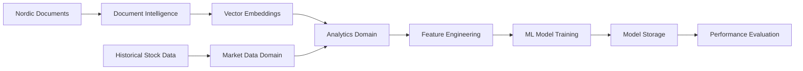
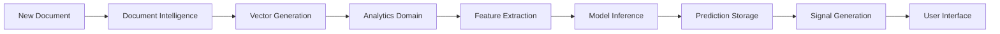
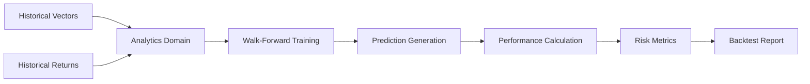

# Vector-Based Prediction Architecture

## 🏗️ Architectural Overview

This document describes how vector-based predictive modeling integrates into the existing YodaBuffett architecture, leveraging the established domain structure and multi-database design.

## 🎯 Domain Allocation

### Document Intelligence Domain (Existing)
**Responsibility**: Vector generation and storage
- ✅ PDF text extraction from 109K+ Nordic documents
- ✅ Document chunking (8K characters, 200 char overlap)
- ✅ Vector embedding generation (OpenAI text-embedding-3-small)
- ✅ Vector storage in `document_embeddings` table with pgvector
- ✅ Semantic search capabilities

**Key Tables**:
- `document_embeddings`: 1.2M vectors × 1536 dimensions
- `extracted_documents`: Document metadata and extracted text
- `extracted_document_chunks`: Text chunks with page mapping

### Analytics Domain (Enhanced)
**Responsibility**: Predictive modeling and intelligence generation
- 🔄 **NEW**: Vector feature extraction for ML models
- 🔄 **NEW**: Multi-model training and management  
- 🔄 **NEW**: Prediction generation and tracking
- 🔄 **NEW**: Backtesting framework with walk-forward validation
- ✅ **Existing**: Cross-company correlation analysis
- ✅ **Existing**: Pattern detection and risk assessment

**Key Tables (New)**:
- `vector_prediction_models`: ML model storage and metadata
- `vector_predictions`: Individual prediction results  
- `model_performance_tracking`: Model accuracy over time
- `backtest_results`: Historical validation results
- `vector_features`: Pre-computed ML features from vectors
- `concept_similarities`: Document similarity to key concepts

### Market Data Domain (Existing)
**Responsibility**: Historical performance data for training/validation
- ✅ Stock price histories for backtesting
- ✅ Company fundamental data
- ✅ Performance calculation utilities
- ✅ Benchmark return calculations

## 📊 Data Flow Architecture

### Training Data Pipeline


### Prediction Pipeline


### Backtesting Pipeline


## 🗄️ Database Architecture Integration

### Enhanced Multi-Database Strategy

#### PostgreSQL + pgvector (Primary)
**Document Intelligence Tables**:
```sql
-- Existing vector storage
document_embeddings (1.2M rows)
├── embedding: vector(1536)
├── chunk_text: TEXT
└── metadata: JSONB

-- Existing document tables  
extracted_documents
extracted_document_chunks
```

**Analytics Enhancement**:
```sql
-- New prediction model storage
vector_prediction_models
├── model_weights: BYTEA (serialized models)
├── feature_config: JSONB (extraction rules)
└── performance_metrics: JSONB

-- New prediction tracking
vector_predictions 
├── prediction_value: JSONB (flexible format)
├── confidence_score: FLOAT
└── model_features: JSONB

-- New performance monitoring
model_performance_tracking
└── backtest_results
```

#### Redis (Caching Layer)
**Vector Prediction Caching**:
```python
# Cache frequently accessed predictions
redis.setex("predictions:VOLV:stock_3m", 3600, {
    "value": 0.087,
    "confidence": 0.73,
    "timestamp": "2025-11-13T10:30:00Z"
})

# Cache model performance metrics
redis.hset("model_performance:stock_3m", {
    "accuracy": "0.68",
    "sharpe_ratio": "1.45", 
    "last_updated": "2025-11-13"
})

# Cache feature extraction results
redis.setex("features:doc_123", 1800, {
    "growth_score": 0.82,
    "risk_score": 0.23,
    "sentiment": 0.71
})
```

## 🔧 Service Architecture

### Analytics Domain Services

#### Core Prediction Services
```python
# Service hierarchy in Analytics domain
VectorPredictionManager
├── VectorFeatureExtractor
│   ├── SemanticFeatureExtractor
│   ├── SentimentFeatureExtractor  
│   └── StructuralFeatureExtractor
├── ModelTrainer
│   ├── StockPerformanceModels
│   ├── ESGModels
│   └── CreditRiskModels
├── PredictionGenerator
└── ModelPerformanceTracker

VectorBacktester
├── WalkForwardValidator
├── PerformanceCalculator
└── ReportGenerator
```

#### Integration with Existing Services
```python
# Enhanced existing services
CorrelationAnalyzer (Enhanced)
├── + VectorSimilarityAnalyzer
└── + PredictiveCorrelationDetector

PatternDetector (Enhanced)  
├── + VectorPatternMatcher
└── + PredictivePatternSignals

SignalGenerator (Enhanced)
├── + VectorBasedSignals
└── + EnsemblePredictionSignals
```

## 🌐 API Architecture Integration

### RESTful API Structure

#### Analytics Domain Endpoints
```yaml
/api/v1/analytics/
├── correlations/          # Existing correlation analysis
├── patterns/              # Existing pattern detection  
├── risk/                  # Existing risk assessment
├── signals/               # Enhanced signal generation
└── predictions/           # NEW: Vector-based predictions
    ├── stock/             # Stock performance predictions
    ├── esg/               # ESG rating predictions  
    ├── credit/            # Credit risk predictions
    ├── models/            # Model management
    └── backtest/          # Backtesting results
```

#### Cross-Domain API Flows
```python
# Example: Generate predictions for new document
1. POST /document-intelligence/process → Extract text & generate vectors
2. POST /analytics/predictions/generate → Create ML predictions
3. GET /analytics/signals/generate → Convert to investment signals
4. POST /notifications/send → Alert users of high-confidence signals
```

## 🔄 Event-Driven Architecture

### Event Flow for New Documents
```python
# Event sequence for new document processing
DocumentProcessed → VectorGenerated → FeaturesExtracted → PredictionsGenerated → SignalsCreated

# Implementation using event bus
EventBus.publish("document_processed", {
    "document_id": "volvo_q3_2024",
    "vectors_generated": True,
    "company": "Volvo"
})

# Analytics domain subscribes to this event
@EventBus.subscribe("document_processed") 
async def generate_predictions(event_data):
    predictions = await prediction_manager.predict_all(event_data.document_id)
    EventBus.publish("predictions_generated", predictions)
```

### Model Retraining Events
```python
# Scheduled model retraining events
@scheduler.cron("0 6 * * MON")  # Every Monday at 6 AM
async def weekly_model_retrain():
    for model in active_models:
        if model.should_retrain():
            EventBus.publish("model_retrain_requested", {
                "model_name": model.name,
                "reason": "scheduled_weekly"
            })
```

## 🚀 Deployment Architecture

### Service Distribution

#### Document Intelligence Service
```yaml
# docker-compose.analytics.yml
document-intelligence:
  build: ./domains/document_intelligence
  environment:
    - VECTOR_DB_URL=postgresql://...
    - OPENAI_API_KEY=${OPENAI_API_KEY}
  volumes:
    - ./data:/app/data
  ports:
    - "8080:8080"
```

#### Analytics Service (Enhanced)
```yaml
analytics-service:
  build: ./domains/analytics  
  environment:
    - ML_DB_URL=postgresql://...
    - REDIS_URL=redis://...
    - VECTOR_SERVICE_URL=http://document-intelligence:8080
  ports:
    - "8090:8090"
  depends_on:
    - document-intelligence
    - redis
    - postgres
```

### Scaling Considerations

#### Prediction Service Scaling
```python
# Horizontal scaling for prediction generation
prediction_workers = {
    "stock_models": 3,      # 3 workers for stock predictions
    "esg_models": 2,        # 2 workers for ESG predictions  
    "credit_models": 2,     # 2 workers for credit predictions
    "feature_extraction": 4  # 4 workers for feature extraction
}

# Load balancing strategy
@app.route("/predictions/<document_id>")
async def predict(document_id):
    # Route to least loaded prediction worker
    worker = get_least_loaded_worker("prediction")
    return await worker.predict(document_id)
```

## 📊 Monitoring & Observability

### Performance Monitoring

#### Model Performance Dashboards
```python
# Key metrics to monitor
monitoring_metrics = {
    "prediction_latency": "p95 < 5 seconds",
    "model_accuracy": "> 65% for all models", 
    "prediction_volume": "predictions per minute",
    "error_rate": "< 1% prediction failures",
    "cache_hit_rate": "> 85% for frequent predictions"
}

# Automated alerting
@monitor.alert("model_accuracy_drop")
def accuracy_below_threshold(model_name, current_accuracy):
    if current_accuracy < 0.60:  # 60% threshold
        send_alert(f"Model {model_name} accuracy dropped to {current_accuracy}")
        trigger_emergency_retraining(model_name)
```

#### Business Intelligence Monitoring
```python
# Track business impact metrics
business_metrics = {
    "alpha_generation": "monthly_excess_returns",
    "signal_quality": "hit_rate_improvement", 
    "client_satisfaction": "prediction_feedback_scores",
    "research_automation": "time_saved_vs_manual",
    "coverage_expansion": "companies_analyzed_automatically"
}
```

## 🔒 Security & Risk Management

### Model Security
- **Access Control**: Role-based API access to predictions
- **Model Versioning**: Immutable model storage with audit trail
- **Prediction Logging**: Complete prediction history for regulatory compliance
- **Bias Detection**: Automated monitoring for model bias and drift

### Data Security  
- **Vector Encryption**: Encrypt vectors at rest in database
- **API Security**: OAuth2/JWT tokens for all prediction endpoints
- **Rate Limiting**: Prevent API abuse and ensure fair access
- **Audit Logging**: Complete audit trail for all predictions and model changes

## 🎯 Migration Strategy

### Phased Implementation

#### Phase 1: Core Infrastructure (Weeks 1-4)
1. Extend Analytics domain database schema
2. Implement VectorFeatureExtractor service
3. Create basic prediction generation pipeline
4. Establish monitoring and logging

#### Phase 2: Model Development (Weeks 5-8)
1. Train initial stock performance models
2. Implement backtesting framework
3. Add ESG and credit risk models  
4. Create automated retraining workflows

#### Phase 3: Production Integration (Weeks 9-12)
1. Deploy prediction APIs
2. Integrate with existing Analytics services
3. Create user-facing dashboards
4. Implement real-time alerting

### Backwards Compatibility
- Existing Analytics APIs remain unchanged
- New prediction endpoints are additive
- Gradual migration of clients to enhanced features
- Fallback to existing correlation/pattern analysis if predictions fail

This architecture seamlessly integrates vector-based predictions into the existing YodaBuffett platform while maintaining clean domain boundaries and ensuring scalability for future enhancements.